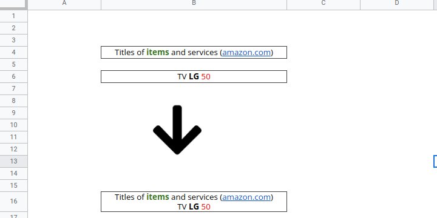

## Join of RichTextValues



Sometimes you need to concatenate two or more `RichTextValue` objects consecutively into one and preserving the formatting.

The following class solves this problem.

- 
- 
- 

### The main code



### Run it




